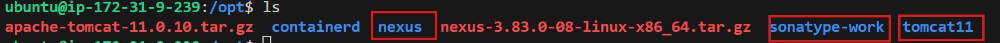
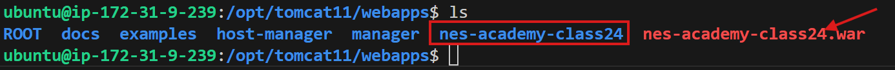
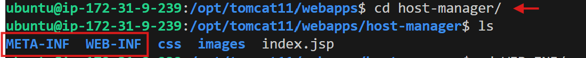

# my-project

.m2>settings.xml

Path for nexus, sonarqube-work, tomcat11

    cd /opt/nexus$
    /opt/sonatype-work/nexus3$
    /opt/tomcat11$
                cd /webapps
                
                